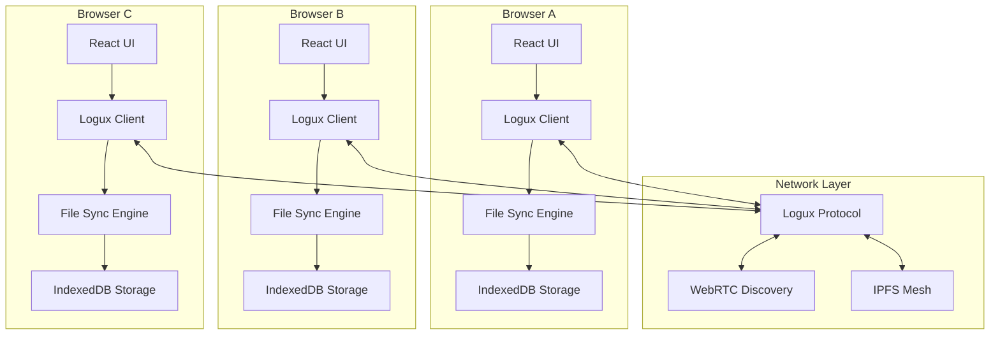
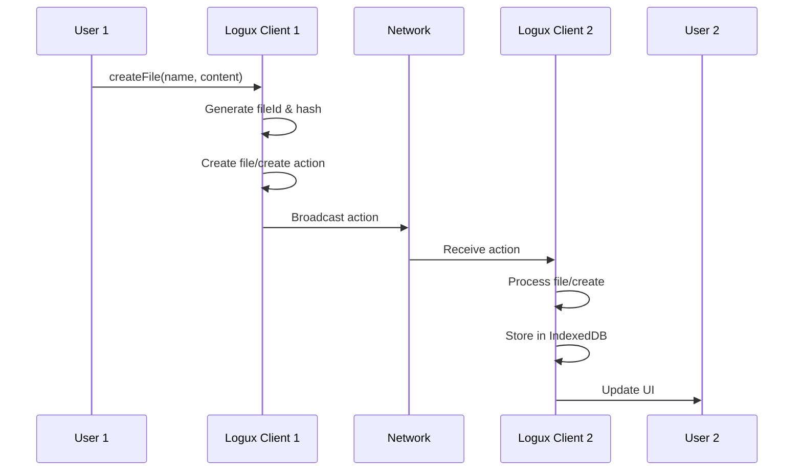
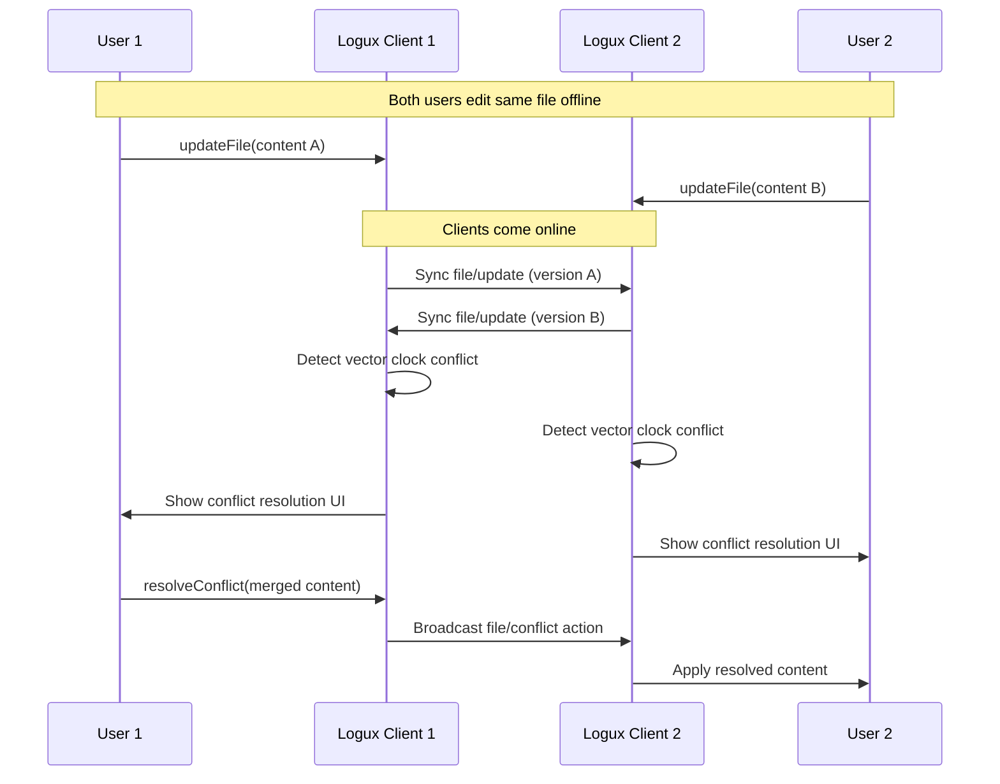

# Logux File Synchronization System Architecture

## Overview

This document provides a comprehensive overview of the Logux-based file synchronization system designed for the Etherith Archival Ecosystem. The system ensures all users see the same shared files through peer-to-peer synchronization, real-time updates, conflict resolution, and offline support.

## System Architecture

### High-Level Architecture



### Core Components

#### 1. Logux Actions System
- **Purpose**: Define all file operations as immutable actions
- **Implementation**: Type-safe action schemas with metadata
- **Key Features**:
  - Immutable action log
  - Distributed timestamp ordering
  - Channel-based subscriptions
  - Vector clock conflict detection

#### 2. File Synchronization Engine
- **Purpose**: Central coordination of file operations
- **Implementation**: Event-driven architecture with IndexedDB persistence
- **Key Features**:
  - Real-time synchronization
  - Conflict detection and resolution
  - Offline-first design
  - Vector clock implementation
  - File locking and presence

#### 3. React Integration Layer
- **Purpose**: Seamless integration with React applications
- **Implementation**: Custom hooks and context providers
- **Key Features**:
  - Reactive state management
  - Optimistic updates
  - Error handling
  - Loading states

#### 4. User Interface Components
- **Purpose**: Rich collaborative file management interface
- **Implementation**: Motion-based components with accessibility
- **Key Features**:
  - Real-time collaboration indicators
  - Conflict resolution UI
  - File management operations
  - Responsive design

## Detailed Implementation

### Action Schema Design

#### Core Action Types

1. **File Operations**
   ```typescript
   - file/create: Create new shared file
   - file/update: Update file content
   - file/delete: Delete file (soft/hard)
   - file/move: Move file to new location
   - file/permission: Change file permissions
   ```

2. **Versioning & Conflicts**
   ```typescript
   - file/version: Create version checkpoint
   - file/conflict: Detect and resolve conflicts
   ```

3. **Collaboration**
   ```typescript
   - file/lock: Lock file for editing
   - file/unlock: Release file lock
   - file/presence: Update user presence
   - file/cursor: Real-time cursor position
   ```

4. **Synchronization**
   ```typescript
   - file/syncStatus: File sync status updates
   ```

#### Metadata Structure

Each action includes comprehensive metadata:

```typescript
interface LoguxFileMeta {
  id: string;                    // Unique action ID
  time: number;                  // Action timestamp
  added: number;                 // Node-specific counter
  reasons: string[];             // Subscription reasons
  subprotocol: string;           // Protocol version
  channels: string[];            // Subscription channels
  nodeId: string;                // Originating node
  userId: string;                // Acting user
  fileHash?: string;             // Content hash
  conflictResolution?: string;   // Conflict strategy
  parentVersion?: string;        // Previous version
  vectorClock?: Record<string, number>; // Distributed clock
}
```

### Synchronization Protocol

#### 1. File Creation Flow



#### 2. Conflict Detection & Resolution



### Storage Architecture

#### IndexedDB Schema

```typescript
// Files Object Store
interface FileRecord {
  id: string;                    // Primary key
  name: string;                  // File name
  path: string;                  // File path
  content: string;               // File content
  version: string;               // Version identifier
  hash: string;                  // Content hash
  permissions: FilePermissions;  // Access control
  metadata: FileMetadata;        // File metadata
  syncStatus: SyncStatus;        // Sync state
  lastSyncTime: number;          // Last sync timestamp
  vectorClock: VectorClock;      // Distributed clock
  conflictVersions?: string[];   // Conflicting versions
  locks: FileLock[];             // Active locks
  presence: UserPresence[];      // User presence
}

// Conflicts Object Store
interface ConflictRecord {
  id: string;                    // Primary key
  fileId: string;                // Related file ID
  conflictingVersions: ConflictVersion[];
  status: 'pending' | 'resolved';
  resolution?: ConflictResolution;
  created: number;
  resolved?: number;
}

// Vector Clocks Object Store
interface VectorClockRecord {
  nodeId: string;                // Primary key
  clocks: Record<string, number>; // Node clocks
}
```

### Network Discovery Integration

The system integrates with the existing network discovery service:

#### Enhanced Network Discovery

```typescript
interface NetworkFileShare {
  nodeId: string;
  availableFiles: string[];      // File IDs available for sharing
  capabilities: {
    supportsLogux: boolean;
    protocolVersion: string;
    maxFileSize: number;
  };
}

// Extended network presence
interface NetworkPresence extends NetworkUser {
  fileSharing: NetworkFileShare;
  onlineStatus: 'online' | 'offline' | 'syncing';
}
```

#### WebRTC Integration

```typescript
class LoguxWebRTCConnection {
  private peerConnection: RTCPeerConnection;
  private dataChannel: RTCDataChannel;

  // Establish P2P connection for file sync
  async connect(remoteNodeId: string): Promise<void> {
    // WebRTC connection setup
    // Data channel for Logux actions
    // File transfer optimization
  }

  // Send Logux action over WebRTC
  async sendAction(action: FileAction, meta: LoguxFileMeta): Promise<void> {
    const message = { action, meta };
    this.dataChannel.send(JSON.stringify(message));
  }
}
```

## Conflict Resolution Strategies

### 1. Vector Clock Algorithm

```typescript
class VectorClock {
  private clocks: Record<string, number> = {};
  private nodeId: string;

  // Increment local clock
  tick(): void {
    this.clocks[this.nodeId] = (this.clocks[this.nodeId] || 0) + 1;
  }

  // Update with remote clock
  update(remoteClock: Record<string, number>): void {
    Object.keys(remoteClock).forEach(nodeId => {
      this.clocks[nodeId] = Math.max(
        this.clocks[nodeId] || 0,
        remoteClock[nodeId]
      );
    });
  }

  // Compare with another clock
  compare(otherClock: Record<string, number>): 'before' | 'after' | 'concurrent' {
    let localGreater = false;
    let remoteGreater = false;

    const allNodes = new Set([
      ...Object.keys(this.clocks),
      ...Object.keys(otherClock)
    ]);

    for (const node of allNodes) {
      const localTime = this.clocks[node] || 0;
      const remoteTime = otherClock[node] || 0;

      if (localTime > remoteTime) localGreater = true;
      if (remoteTime > localTime) remoteGreater = true;
    }

    if (localGreater && !remoteGreater) return 'after';
    if (remoteGreater && !localGreater) return 'before';
    return 'concurrent'; // Conflict detected
  }
}
```

### 2. Three-Way Merge Algorithm

```typescript
class ThreeWayMerge {
  static merge(
    baseContent: string,
    localContent: string,
    remoteContent: string
  ): MergeResult {
    // Implement diff-based three-way merge
    const baseLines = baseContent.split('\n');
    const localLines = localContent.split('\n');
    const remoteLines = remoteContent.split('\n');

    const localDiff = this.diff(baseLines, localLines);
    const remoteDiff = this.diff(baseLines, remoteLines);

    return this.mergeDiffs(baseLines, localDiff, remoteDiff);
  }

  private static diff(from: string[], to: string[]): DiffOperation[] {
    // Implement Myers diff algorithm
    // Return array of insert/delete/replace operations
  }

  private static mergeDiffs(
    base: string[],
    localDiff: DiffOperation[],
    remoteDiff: DiffOperation[]
  ): MergeResult {
    // Apply both diffs and detect conflicts
    // Return merged content or conflict markers
  }
}
```

### 3. User-Driven Resolution

```typescript
interface ConflictResolutionUI {
  // Show conflict to user
  presentConflict(conflict: FileConflict): Promise<ConflictResolution>;

  // Auto-merge strategies
  autoMerge(conflict: FileConflict): Promise<ConflictResolution | null>;

  // Manual merge editor
  openMergeEditor(conflict: FileConflict): Promise<ConflictResolution>;
}
```

## Performance Optimizations

### 1. Incremental Synchronization

```typescript
class IncrementalSync {
  // Only sync changed content
  async syncChanges(fileId: string, lastSyncTime: number): Promise<void> {
    const actions = await this.getActionsSince(fileId, lastSyncTime);
    for (const action of actions) {
      await this.processAction(action);
    }
  }

  // Delta compression for large files
  createDelta(oldContent: string, newContent: string): FileDelta {
    return this.binaryDiff(oldContent, newContent);
  }
}
```

### 2. Caching Strategy

```typescript
class FileSyncCache {
  private memoryCache = new Map<string, SyncedFile>();
  private lruEviction = new LRUCache<string, SyncedFile>(1000);

  // Multi-level caching
  async getFile(fileId: string): Promise<SyncedFile | null> {
    // 1. Memory cache
    if (this.memoryCache.has(fileId)) {
      return this.memoryCache.get(fileId)!;
    }

    // 2. LRU cache
    if (this.lruEviction.has(fileId)) {
      const file = this.lruEviction.get(fileId)!;
      this.memoryCache.set(fileId, file);
      return file;
    }

    // 3. IndexedDB
    const file = await this.loadFromStorage(fileId);
    if (file) {
      this.lruEviction.set(fileId, file);
      this.memoryCache.set(fileId, file);
    }

    return file;
  }
}
```

### 3. Bandwidth Optimization

```typescript
class BandwidthOptimizer {
  // Compress actions before transmission
  compressAction(action: FileAction): CompressedAction {
    return {
      ...action,
      content: this.compress(action.content),
      compressed: true
    };
  }

  // Batch multiple actions
  batchActions(actions: FileAction[]): BatchedAction {
    return {
      type: 'batch',
      actions: actions.map(a => this.compressAction(a)),
      timestamp: Date.now()
    };
  }

  // Adaptive sync frequency
  getOptimalSyncInterval(networkQuality: NetworkQuality): number {
    switch (networkQuality) {
      case 'high': return 1000;    // 1 second
      case 'medium': return 5000;  // 5 seconds
      case 'low': return 15000;    // 15 seconds
      default: return 30000;       // 30 seconds
    }
  }
}
```

## Security Considerations

### 1. Access Control

```typescript
interface FilePermissions {
  owner: string;                 // File owner user ID
  readers: string[];             // Read access user IDs
  writers: string[];             // Write access user IDs
  public: boolean;               // Public file flag
  accessLevel: 'read' | 'write' | 'admin';
}

class AccessControl {
  canRead(file: SyncedFile, userId: string): boolean {
    return file.permissions.public ||
           file.permissions.owner === userId ||
           file.permissions.readers.includes(userId) ||
           file.permissions.writers.includes(userId);
  }

  canWrite(file: SyncedFile, userId: string): boolean {
    return file.permissions.owner === userId ||
           file.permissions.writers.includes(userId) ||
           (file.permissions.public && file.permissions.accessLevel === 'write');
  }
}
```

### 2. Content Integrity

```typescript
class ContentIntegrity {
  // Verify file content hasn't been tampered with
  async verifyIntegrity(file: SyncedFile): Promise<boolean> {
    const computedHash = await this.calculateHash(file.content);
    return computedHash === file.hash;
  }

  // Sign actions for authenticity
  async signAction(action: FileAction, privateKey: CryptoKey): Promise<SignedAction> {
    const signature = await crypto.subtle.sign(
      'RSASSA-PKCS1-v1_5',
      privateKey,
      new TextEncoder().encode(JSON.stringify(action))
    );

    return {
      ...action,
      signature: Array.from(new Uint8Array(signature))
    };
  }
}
```

### 3. Data Encryption

```typescript
class DataEncryption {
  // Encrypt sensitive file content
  async encryptContent(content: string, key: CryptoKey): Promise<string> {
    const iv = crypto.getRandomValues(new Uint8Array(12));
    const encodedContent = new TextEncoder().encode(content);

    const encrypted = await crypto.subtle.encrypt(
      { name: 'AES-GCM', iv },
      key,
      encodedContent
    );

    return JSON.stringify({
      iv: Array.from(iv),
      content: Array.from(new Uint8Array(encrypted))
    });
  }

  // Decrypt file content
  async decryptContent(encryptedContent: string, key: CryptoKey): Promise<string> {
    const { iv, content } = JSON.parse(encryptedContent);

    const decrypted = await crypto.subtle.decrypt(
      { name: 'AES-GCM', iv: new Uint8Array(iv) },
      key,
      new Uint8Array(content)
    );

    return new TextDecoder().decode(decrypted);
  }
}
```

## API Reference

### Core Classes

#### LoguxFileSyncEngine

```typescript
class LoguxFileSyncEngine {
  constructor(client: LoguxClient, userId: string);

  // File operations
  async createFile(name: string, content: string, mimeType: string, permissions: FilePermissions): Promise<string>;
  async updateFile(fileId: string, content: string, reason?: string): Promise<void>;
  async deleteFile(fileId: string, soft?: boolean): Promise<void>;
  async moveFile(fileId: string, newPath: string): Promise<void>;

  // Access methods
  getFile(fileId: string): SyncedFile | undefined;
  getAllFiles(): SyncedFile[];
  getConflicts(): FileConflict[];
  getUserFiles(userId: string): SyncedFile[];
  getPublicFiles(): SyncedFile[];

  // Subscription management
  async subscribeToFile(fileId: string): Promise<void>;
  async unsubscribeFromFile(fileId: string): Promise<void>;

  // Conflict resolution
  async resolveConflict(conflictId: string, resolution: ConflictResolution): Promise<void>;
}
```

#### useLoguxFileSync Hook

```typescript
function useLoguxFileSync(options: UseLoguxFileSyncOptions): UseLoguxFileSyncReturn {
  // Returns comprehensive file sync interface
  // See implementation for full API
}
```

### Action Creators

```typescript
// File operation action creators
export const createFileAction = (
  fileId: string,
  fileName: string,
  content: string,
  mimeType: string,
  permissions: FilePermissions,
  authorId: string
): FileCreateAction;

export const updateFileAction = (
  fileId: string,
  content: string,
  version: string,
  authorId: string
): FileUpdateAction;

export const deleteFileAction = (
  fileId: string,
  soft: boolean,
  authorId: string
): FileDeleteAction;

// Collaboration action creators
export const lockFileAction = (
  fileId: string,
  lockType: 'edit' | 'view' | 'exclusive',
  duration: number,
  authorId: string
): FileLockAction;

export const updatePresenceAction = (
  fileId: string,
  userId: string,
  status: 'viewing' | 'editing' | 'idle',
  cursor?: CursorPosition
): FilePresenceAction;
```

## Usage Examples

### Basic File Operations

```typescript
import { useLoguxFileSync } from '../hooks/useLoguxFileSync';

function MyComponent() {
  const {
    files,
    createFile,
    updateFile,
    deleteFile,
    conflicts,
    resolveConflict
  } = useLoguxFileSync({ userId: 'user123' });

  // Create a new file
  const handleCreateFile = async () => {
    const permissions = {
      owner: 'user123',
      readers: [],
      writers: ['user456'],
      public: true,
      accessLevel: 'write' as const
    };

    const fileId = await createFile(
      'shared-document.txt',
      'Initial content',
      'text/plain',
      permissions
    );

    console.log('Created file:', fileId);
  };

  // Update file content
  const handleUpdateFile = async (fileId: string) => {
    await updateFile(fileId, 'Updated content');
  };

  // Resolve conflict
  const handleResolveConflict = async (conflict: FileConflict) => {
    const resolution = {
      type: 'manual' as const,
      resolvedContent: 'Manually merged content',
      resolvedBy: 'user123',
      timestamp: Date.now()
    };

    await resolveConflict(conflict.id, resolution);
  };

  return (
    <div>
      <h2>Shared Files ({files.length})</h2>
      {conflicts.length > 0 && (
        <p>Conflicts need resolution: {conflicts.length}</p>
      )}
      <button onClick={handleCreateFile}>Create File</button>
      {/* Render files and conflicts */}
    </div>
  );
}
```

### Real-time Collaboration

```typescript
function CollaborativeEditor({ fileId }: { fileId: string }) {
  const {
    getFile,
    updateFile,
    getFilePresence,
    updatePresence
  } = useLoguxFileSync({ userId: 'user123' });

  const [content, setContent] = useState('');
  const file = getFile(fileId);
  const presence = getFilePresence(fileId);

  useEffect(() => {
    if (file) {
      setContent(file.content);
    }
  }, [file]);

  const handleContentChange = (newContent: string) => {
    setContent(newContent);
    updatePresence(fileId, 'editing');

    // Debounced auto-save
    debouncedSave(fileId, newContent);
  };

  const debouncedSave = useCallback(
    debounce(async (fileId: string, content: string) => {
      await updateFile(fileId, content);
      updatePresence(fileId, 'viewing');
    }, 1000),
    [updateFile, updatePresence]
  );

  return (
    <div>
      <div className="presence-indicators">
        {presence.map(user => (
          <div key={user.userId} className={`user-${user.status}`}>
            {user.userName} ({user.status})
          </div>
        ))}
      </div>

      <textarea
        value={content}
        onChange={(e) => handleContentChange(e.target.value)}
        onFocus={() => updatePresence(fileId, 'editing')}
        onBlur={() => updatePresence(fileId, 'viewing')}
      />
    </div>
  );
}
```

## Testing Strategy

### Unit Tests

```typescript
describe('LoguxFileSyncEngine', () => {
  let engine: LoguxFileSyncEngine;
  let mockClient: LoguxClient;

  beforeEach(() => {
    mockClient = createMockLoguxClient();
    engine = new LoguxFileSyncEngine(mockClient, 'user123');
  });

  test('creates file successfully', async () => {
    const fileId = await engine.createFile(
      'test.txt',
      'content',
      'text/plain',
      mockPermissions
    );

    expect(fileId).toBeDefined();
    expect(engine.getFile(fileId)).toBeDefined();
  });

  test('detects conflicts correctly', async () => {
    // Set up conflicting updates
    // Verify conflict detection logic
  });
});
```

### Integration Tests

```typescript
describe('File Sync Integration', () => {
  test('synchronizes between multiple clients', async () => {
    const client1 = createLoguxClient('node1');
    const client2 = createLoguxClient('node2');

    const engine1 = new LoguxFileSyncEngine(client1, 'user1');
    const engine2 = new LoguxFileSyncEngine(client2, 'user2');

    // Create file on engine1
    const fileId = await engine1.createFile('test.txt', 'content', 'text/plain', permissions);

    // Wait for synchronization
    await waitForSync();

    // Verify file appears on engine2
    const syncedFile = engine2.getFile(fileId);
    expect(syncedFile).toBeDefined();
    expect(syncedFile?.content).toBe('content');
  });
});
```

## Performance Monitoring

### Metrics Collection

```typescript
class PerformanceMonitor {
  private metrics = {
    syncLatency: new Array<number>(),
    conflictRate: 0,
    storageUsage: 0,
    networkBandwidth: 0
  };

  recordSyncLatency(latency: number): void {
    this.metrics.syncLatency.push(latency);
    if (this.metrics.syncLatency.length > 100) {
      this.metrics.syncLatency.shift();
    }
  }

  getAverageSyncLatency(): number {
    const latencies = this.metrics.syncLatency;
    return latencies.reduce((sum, lat) => sum + lat, 0) / latencies.length;
  }

  recordConflict(): void {
    this.metrics.conflictRate++;
  }

  generateReport(): PerformanceReport {
    return {
      avgSyncLatency: this.getAverageSyncLatency(),
      conflictRate: this.metrics.conflictRate,
      storageUsage: this.metrics.storageUsage,
      networkBandwidth: this.metrics.networkBandwidth,
      timestamp: Date.now()
    };
  }
}
```

## Migration & Deployment

### Integration with Existing System

```typescript
// Migrate existing Memory objects to SyncedFile format
class MemoryMigration {
  async migrateMemoriesToSyncedFiles(): Promise<void> {
    const memories = LocalStorage.getAllMemories();

    for (const memory of memories) {
      const syncedFile = this.convertMemoryToSyncedFile(memory);
      await this.fileSyncEngine.createFile(
        syncedFile.name,
        syncedFile.content,
        syncedFile.metadata.mimeType || 'text/plain',
        this.createPermissionsFromMemory(memory)
      );
    }
  }

  private convertMemoryToSyncedFile(memory: Memory): Partial<SyncedFile> {
    return {
      name: memory.title || 'Untitled',
      content: memory.content,
      path: `/${memory.id}`,
      metadata: {
        size: memory.content.length,
        hash: '',
        encoding: 'utf-8',
        created: memory.timestamp,
        lastModified: memory.timestamp,
        tags: memory.tags || [],
        description: memory.memoryNote
      }
    };
  }
}
```

### Progressive Enhancement

```typescript
// Gradually enable file sync features
class FeatureToggle {
  private enabled = {
    fileSync: false,
    realTimeCollaboration: false,
    conflictResolution: false,
    offlineSupport: false
  };

  enableFeature(feature: keyof typeof this.enabled): void {
    this.enabled[feature] = true;
    this.notifyFeatureChange(feature);
  }

  isEnabled(feature: keyof typeof this.enabled): boolean {
    return this.enabled[feature];
  }
}
```

## Conclusion

This Logux-based file synchronization system provides a robust, scalable solution for collaborative file management in the Etherith Archival Ecosystem. Key benefits include:

1. **Real-time Synchronization**: Immediate propagation of changes across all connected users
2. **Conflict Resolution**: Intelligent handling of concurrent edits with user-friendly resolution
3. **Offline Support**: Full functionality when disconnected with automatic sync on reconnection
4. **Scalable Architecture**: Peer-to-peer design that scales horizontally
5. **Type Safety**: Comprehensive TypeScript implementation with full type coverage
6. **Performance Optimized**: Efficient caching, compression, and incremental sync
7. **Security Focused**: Access control, content integrity, and encryption support
8. **Accessible UI**: WCAG compliant interface with keyboard navigation and screen reader support

The system integrates seamlessly with the existing Etherith ecosystem while providing a foundation for advanced collaborative features.